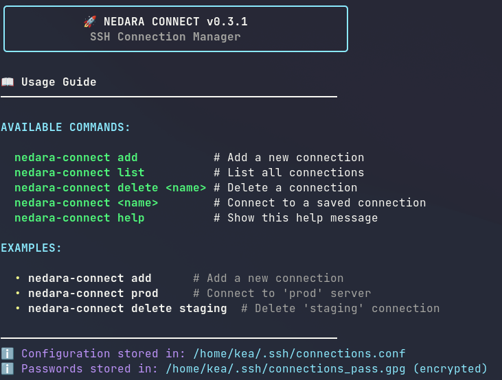

# Nedara Connect

**Nedara Connect** is a lightweight shell tool for managing and connecting to SSH hosts using simple aliases with secure password storage.

Easily store and reuse your SSH connection configurations without needing to remember long commands or edit your `~/.ssh/config`.



## ✨ Features

- Add new SSH connections with a friendly prompt
- List all saved connections with security status
- Quickly connect using simple names
- Optional secure password storage using GPG encryption
- Delete existing connections
- Stores connection data securely:
  - Configurations in `~/.ssh/connections.conf`
  - Encrypted passwords in `~/.ssh/connections_pass.gpg`

## 📦 Installation

### Prerequisites

Ensure you have these installed:
- `gpg` (GNU Privacy Guard) - for password encryption
- `sshpass` - for automatic password authentication (only needed if using password storage)

Install on Ubuntu/Debian:
```bash
sudo apt-get install gpg sshpass
```
Install on macOS (using Homebrew):
```bash
brew install gpg sshpass
```

### 1. Clone the Repository

```bash
git clone https://github.com/Nedara-Project/nedara-connect.git
cd nedara-connect
chmod +x nedara-connect.sh
```

### 2. Add Alias to Your Shell Config

Add the following alias to your shell profile (`~/.bashrc`, `~/.zshrc`, [...], etc.):


```bash
alias nedara-connect="$HOME/path/to/nedara-connect/nedara-connect.sh"
```

Then reload your shell config:

```bash
source ~/.bashrc    # or source ~/.zshrc
```

> Replace `$HOME/path/to/nedara-connect/` with the actual path where you cloned the repo.

### 🧪 Optional: One-line Installer

You can also install it using the bundled installer:

```bash
curl -s https://raw.githubusercontent.com/Nedara-Project/nedara-connect/main/install.sh | bash -
```

*(Make sure `install.sh` exists in the repo — see below.)*

## 🚀 Usage

### Add a new connection

```bash
nedara-connect add
```

### List saved connections

```bash
nedara-connect list
```

### Connect to a saved host

```bash
nedara-connect <connection-name>
```

### Delete a connection

```bash
nedara-connect delete <connection-name>
```

### Help

```bash
nedara-connect help
```

## 🔐 Connection File

All connections are stored in:

```
~/.ssh/connections.conf
```

Each entry has the format:

```
<name>:<username>:<host>:<port>
```

All sensitive data is stored securely:
- Configurations in ~/.ssh/connections.conf (plain text)
- Passwords in ~/.ssh/connections_pass.gpg (encrypted with GPG)

---

## 📁 Example

```bash
nedara-connect add
# Enter connection name (e.g., staging)
# Enter username
# Enter hostname or IP
# Enter port (default is 22)
# Save password? [y/N]
# Enter password
```

Then later:

```bash
nedara-connect staging
```

---

## 📄 License

MIT License — see `LICENSE` for details.
