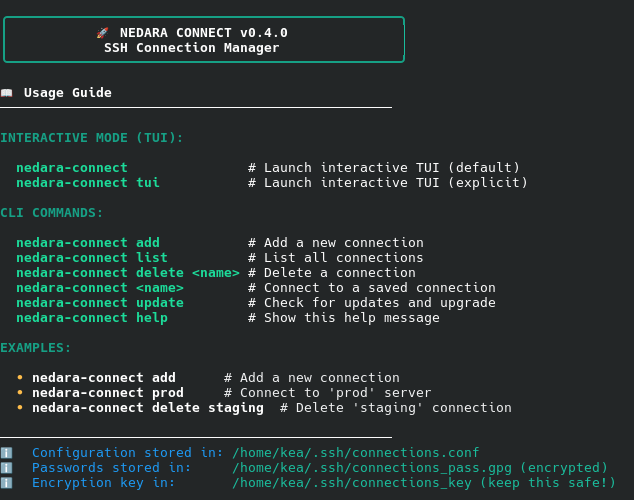

# Nedara Connect

**Nedara Connect** is a lightweight shell tool for managing and connecting to SSH hosts using simple aliases with secure password storage.

Easily store and reuse your SSH connection configurations without needing to remember long commands or edit your `~/.ssh/config`.



## ✨ Features

- Add new SSH connections with a friendly prompt
- List all saved connections with security status
- Quickly connect using simple names
- Optional secure password storage using GPG encryption
- Delete existing connections
- Interactive TUI mode with arrow-key navigation (pure bash, no extra dependencies)
- Stores connection data securely:
  - Configurations in `~/.ssh/connections.conf`
  - Encrypted passwords in `~/.ssh/connections_pass.gpg`
  - Per-machine encryption key in `~/.ssh/connections_key`

## 📦 Installation

### Prerequisites

Ensure you have these installed:
- `gpg` (GNU Privacy Guard) - for password encryption
- `sshpass` - for automatic password authentication (only needed if using password storage)

Install on Ubuntu/Debian:
```bash
sudo apt-get install gpg sshpass
```
Install on macOS (using Homebrew):
```bash
brew install gpg sshpass
```

### 1. Clone the Repository

```bash
git clone https://github.com/Nedara-Project/nedara-connect.git
cd nedara-connect
chmod +x nedara-connect.sh
```

### 2. Add Alias to Your Shell Config

Add the following alias to your shell profile (`~/.bashrc`, `~/.zshrc`, [...], etc.):


```bash
alias nedara-connect="$HOME/path/to/nedara-connect/nedara-connect.sh"
```

Then reload your shell config:

```bash
source ~/.bashrc    # or source ~/.zshrc
```

> Replace `$HOME/path/to/nedara-connect/` with the actual path where you cloned the repo.

### 🧪 Optional: One-line Installer

You can also install it using the bundled installer:

```bash
curl -s https://raw.githubusercontent.com/Nedara-Project/nedara-connect/main/install.sh | bash -
```

*(Make sure `install.sh` exists in the repo — see below.)*

## 🚀 Usage

### Interactive TUI (default)

Running `nedara-connect` with no arguments launches the interactive terminal UI:

```bash
nedara-connect
# or explicitly:
nedara-connect tui
```

Navigate with arrow keys, confirm with Enter, `q` to go back. No additional dependencies required — the TUI is implemented in pure bash.

---

### CLI commands

```bash
nedara-connect add                  # Add a new connection
nedara-connect list                 # List all connections
nedara-connect <connection-name>    # Connect directly by name
nedara-connect delete <name>        # Delete a connection
nedara-connect help                 # Show help
```

## 🔐 Connection File

All connections are stored in:

```
~/.ssh/connections.conf
```

Each entry has the format:

```
<name>:<username>:<host>:<port>
```

All sensitive data is stored securely:

| File | Purpose |
|---|---|
| `~/.ssh/connections.conf` | Connection list (name, user, host, port) |
| `~/.ssh/connections_pass.gpg` | Passwords encrypted with GPG |
| `~/.ssh/connections_key` | Per-machine encryption key (auto-generated) |

The encryption key is generated automatically on first use using `/dev/urandom` and never leaves your machine. **Back it up if you want to be able to restore your saved passwords** — losing `connections_key` makes `connections_pass.gpg` unrecoverable.

---

## 📁 Example

```bash
nedara-connect add
# Enter connection name (e.g., staging)
# Enter username
# Enter hostname or IP
# Enter port (default is 22)
# Save password? [y/N]
# Enter password
```

Then later:

```bash
nedara-connect staging
```

---

## ⬆️ Updating

### Built-in update command

The easiest way to update is to use the built-in command:

```bash
nedara-connect update
```

It fetches the latest version number from GitHub, compares it with your local version, and downloads the update if one is available.

### Manual update — one-line installer

If you installed via the one-liner, re-run it:

```bash
curl -s https://raw.githubusercontent.com/Nedara-Project/nedara-connect/main/install.sh | bash -
```

### Manual update — git clone

If you cloned the repository:

```bash
cd nedara-connect
git pull
```

---

### Migrating from older versions

If you are upgrading from a version prior to **0.4.0**, your saved passwords will be migrated automatically on the first run. No action needed — the tool detects the old format and re-encrypts your passwords using the new per-machine key.

---

## 📄 License

MIT License — see `LICENSE` for details.
